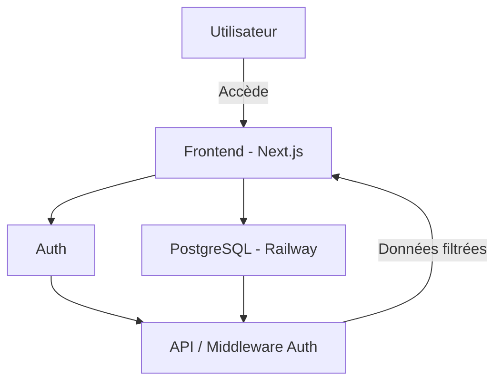

# Manda

**Manda** est une plateforme éducative tout-en-un qui vise à démocratiser l’accès aux compétences numériques en Afrique. Elle permet aux jeunes d’apprendre, de se certifier et d’accéder à des opportunités professionnelles — entièrement en ligne.

---

## Objectif du projet

Offrir aux jeunes, où qu’ils soient, les moyens de se former aux métiers du numérique, de valider leurs compétences et de se connecter à des employeurs ou partenaires de projets à impact.

---

## Cas d’utilisation

### Apprenant

- S’inscrire et suivre des cours en ligne (vidéos, textes)
- Réaliser des projets pratiques
- Obtenir un certificat numérique
- Suivre sa progression par module
- Accéder à des opportunités de stage ou d’emploi

### Formateur

- Créer des cours et modules pédagogiques
- Ajouter des vidéos, textes, quiz et ressources
- Suivre la progression des étudiants

### Admin

- Gérer les utilisateurs, cours et statistiques
- Modérer les contenus
- Attribuer les rôles

### Partenaire / Recruteur

- Publier des offres d’emploi ou de stage
- Rechercher des profils certifiés
- Contacter directement les talents

---

## Fonctionnalités (Roadmap)

- [ ] Authentification sécurisée (JWT)
- [ ] Gestion des rôles et permissions (Admin, Étudiant, Formateur, Partenaire)
- [ ] Suivi des cours et modules
- [ ] Création et édition de contenus pédagogiques
- [ ] Génération de certificats PDF téléchargeables
- [ ] Projets pratiques soumis par les étudiants
- [ ] Tableau de bord personnalisé selon le rôle
- [ ] Espace recruteur avec filtrage par certification
- [ ] Messagerie interne étudiants-formateurs
- [ ] Classements et badges de réussite
- [ ] API publique pour les partenaires tiers

---

## Stack technique

- **Frontend** : Next.js, Tailwind CSS, TypeScript
- **Backend** : Railway (PostgreSQL), API custom (JWT)
- **Base de données** : PostgreSQL + Prisma
- **UI/UX** : shadcn/ui, Lucide Icons
- **Déploiement** : Vercel (frontend) + Railway (backend)
- **Outils de documentation** : Draw.io, Figma

---

## Architecture (haut niveau)

