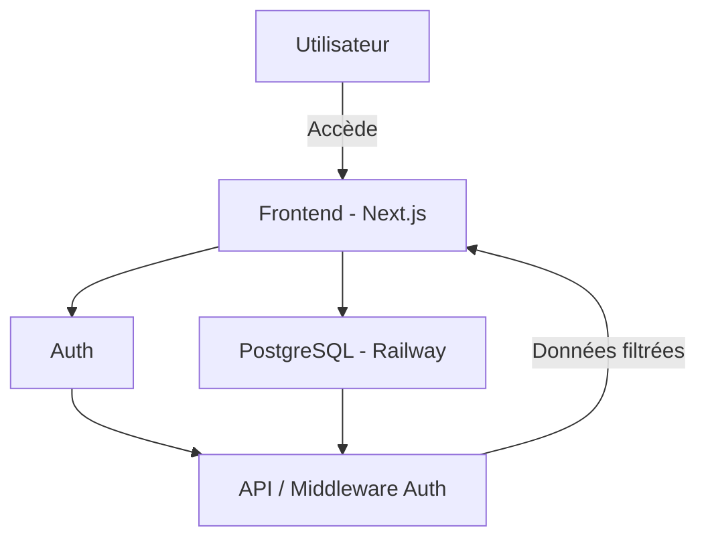

# Manda

Manda est une plateforme éducative tout‑en‑un visant à démocratiser l’accès aux compétences numériques en Afrique. Elle permet aux jeunes d’apprendre, de se certifier et d’accéder à des opportunités professionnelles — le tout en ligne.

---

## Objectif du projet

Donner aux jeunes, où qu’ils soient, les moyens de se former aux métiers du numérique, valider leurs compétences et entrer en contact avec des employeurs ou partenaires de projets à impact.

---

## Cas d’utilisation

- Apprenant

  - S’inscrire et suivre des cours en ligne (vidéos, textes)
  - Réaliser des projets pratiques
  - Obtenir un certificat numérique
  - Suivre sa progression par module
  - Accéder à des opportunités de stage ou d’emploi

- Formateur

  - Créer des cours et modules pédagogiques
  - Ajouter des vidéos, textes, quiz et ressources
  - Suivre la progression des étudiants

- Admin

  - Gérer les utilisateurs, cours et statistiques
  - Modérer les contenus
  - Attribuer les rôles

- Partenaire / Recruteur
  - Publier des offres d’emploi ou de stage
  - Rechercher des profils certifiés
  - Contacter directement les talents

---

## Fonctionnalités (roadmap)

- [ ] Authentification sécurisée (JWT)
- [ ] Rôles et permissions (Admin, Étudiant, Formateur, Partenaire)
- [ ] Suivi des cours et modules
- [ ] Création et édition de contenus pédagogiques
- [ ] Génération de certificats PDF téléchargeables
- [ ] Projets pratiques soumis par les étudiants
- [ ] Tableau de bord personnalisé par rôle
- [ ] Espace recruteur avec filtrage par certification
- [ ] Messagerie interne étudiants‑formateurs
- [ ] Classements et badges de réussite
- [ ] API publique pour partenaires tiers

---

## Stack technique

- Frontend: Next.js, Tailwind CSS, TypeScript
- Backend: Railway (PostgreSQL), API custom (JWT)
- Base de données: PostgreSQL + Prisma
- UI/UX: shadcn/ui, Lucide Icons
- Déploiement: Vercel (frontend) + Railway (backend)
- Diagrammes & Docs: Draw.io, Figma

---

## Architecture (haut niveau)

---

## Démarrage rapide

- Prérequis: Node 18+, NPM/PNPM, PostgreSQL (Railway ou local)
- Installation:
  - Copier `.env.example` vers `.env` et renseigner `DATABASE_URL` et `JWT_SECRET`.
  - Générer le client Prisma: `npm run prisma:generate`
  - Pousser le schéma en base: `npm run prisma:push` (ou `npm run prisma:migrate` en dev)
  - Lancer l’app: `npm run dev`

Endpoints utiles:

- GET `/api/health` — statut rapide de l’application

---

## Prochaines étapes (Backend)

- Choix d’architecture:
  - A) API dédiée sur Railway (Express/Nest + JWT) — Front Next.js consomme l’API
  - B) API intégrée (Next.js Route Handlers `app/api`) — plus simple, déploiement unique
- À valider: préférence A ou B, flux auth (signup, login, refresh), gestion des rôles.
- Implémenter ensuite: Auth JWT + rôles, CRUD de base (Users, Cours, Modules…), suivi de progression, messagerie.

---

## Développement

- Prisma: schéma sous `prisma/schema.prisma`, migrations sous `prisma/migrations`
- Client Prisma unique via `lib/prisma.ts`
- Tailwind v4 activé via `app/globals.css`
- Endpoint santé: `app/api/health/route.ts`
